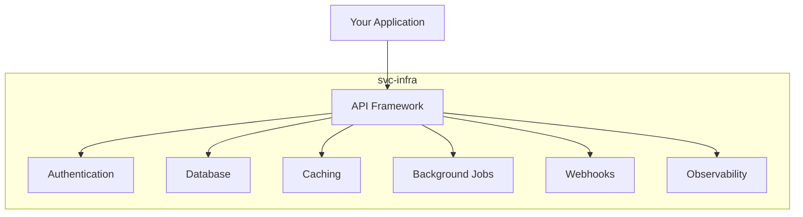

# svc-infra

**Infrastructure for building and deploying prod-ready services**

svc-infra is a comprehensive Python package that provides all the backend primitives you need to build production-ready services. It's designed to be reusable across many applications and teams.

## Features

<div class="grid cards" markdown>

-   :material-api:{ .lg .middle } **API Framework**

    ---

    FastAPI-based scaffolding with dual routers, automatic OpenAPI generation, and middleware stack.

    [:octicons-arrow-right-24: API docs](api.md)

-   :material-lock:{ .lg .middle } **Authentication**

    ---

    OAuth2, sessions, MFA, password policies, JWT tokens, and user management.

    [:octicons-arrow-right-24: Auth docs](auth.md)

-   :material-database:{ .lg .middle } **Database**

    ---

    SQLAlchemy ORM, Alembic migrations, connection pooling, and multi-database support.

    [:octicons-arrow-right-24: Database docs](database.md)

-   :material-cached:{ .lg .middle } **Caching**

    ---

    Redis caching, cache decorators, TTL management, and invalidation strategies.

    [:octicons-arrow-right-24: Cache docs](cache.md)

-   :material-timer-sand:{ .lg .middle } **Background Jobs**

    ---

    Job queues, workers, schedulers, and retry logic for async processing.

    [:octicons-arrow-right-24: Jobs docs](jobs.md)

-   :material-webhook:{ .lg .middle } **Webhooks**

    ---

    Webhook signing, delivery, retry, and subscription management.

    [:octicons-arrow-right-24: Webhooks docs](webhooks.md)

-   :material-cloud-upload:{ .lg .middle } **Deployment**

    ---

    Platform detection for Railway, Render, AWS, GCP, Azure with environment resolution.

    [:octicons-arrow-right-24: Deploy docs](deploy.md)

-   :material-text-box:{ .lg .middle } **Logging**

    ---

    Structured JSON logging, context injection, and container-optimized output.

    [:octicons-arrow-right-24: Logging docs](logging.md)

-   :material-test-tube:{ .lg .middle } **Testing**

    ---

    Mock cache, mock job queue, and fixture factories for testing without external services.

    [:octicons-arrow-right-24: Testing docs](testing.md)

-   :material-wrench:{ .lg .middle } **Developer Experience**

    ---

    CI workflow generation, changelog tools, and code quality checks.

    [:octicons-arrow-right-24: DX docs](dx.md)

</div>

## Quick Start

```python
from svc_infra import easy_service_app
from svc_infra.logging import setup_logging
from svc_infra.cache import init_cache

# Setup logging
setup_logging()

# Create FastAPI app with all infra configured
app = easy_service_app(name="MyService")

# Initialize cache
await init_cache(url="redis://localhost")

@app.get("/health")
async def health():
    return {"status": "healthy"}
```

## Installation

```bash
pip install svc-infra
```

With extras:

```bash
pip install svc-infra[pg,redis,payments]
```

## Architecture



## License

MIT License - see [LICENSE](https://github.com/nfraxlab/svc-infra/blob/main/LICENSE) for details.
